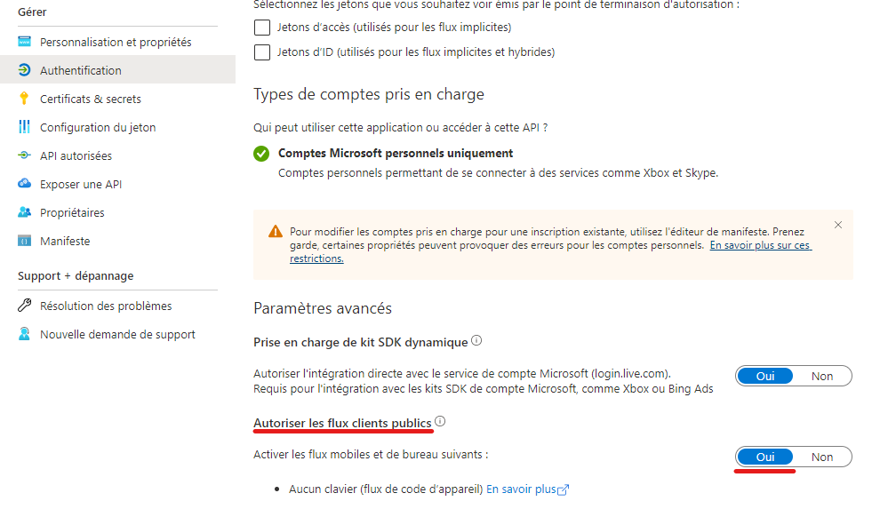

# v1.0.1

## January 15, 2023

### Added :

- Added `CHANGELOG.md` file to track changes.
- Fix bug
  - `require("msamc")` -> `require("msamc").default`

## January 15, 2023

### Added :

- Added another preview image to `README.md`. 
- Fix bug
  - Added instructions about mobile mode.

## January 21, 2023

### Added :

- Added `.npmignore` file to ignore preview images when publishing to npm.
- Changed package version to `1.0.3`.
