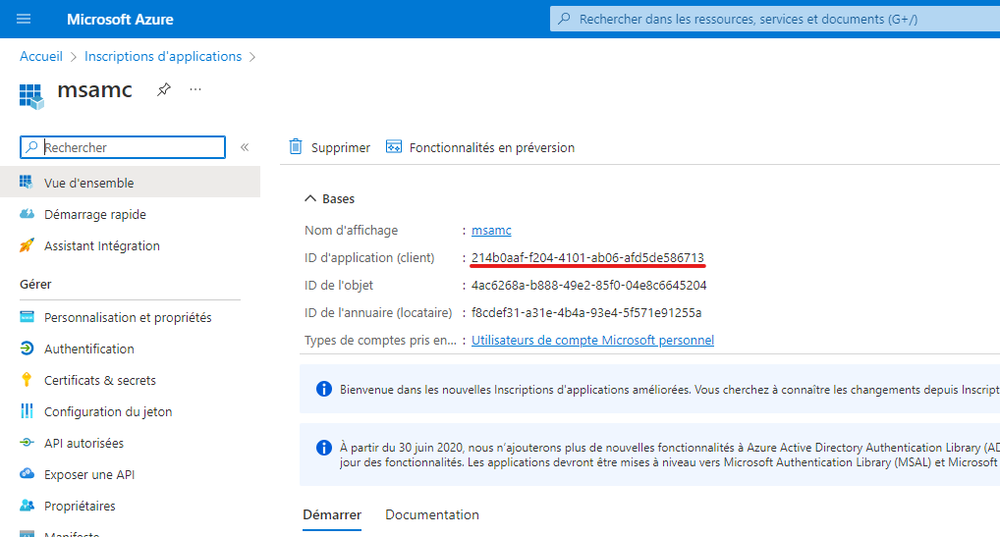

# MS Account for Minecraft Login

- 💻 Login to Minecraft (Java) using a Microsoft account.
- 👌 Compatible with MLC ([minecraft-launcher-core](https://www.npmjs.com/package/minecraft-launcher-core)).

## Installation

```bash
npm install msamc
```

## Usage

### Without MLC:

```js
const msamc = require("msamc");

new msamc("YOUR_APP_ID").Authenticate().then((auth) => {
  console.log(auth);
});
```

The `auth` object will contain the following properties after a successful authentication:

```js
{
  MinecraftProfile: {
    {
      id : "REAL_USER_UUID",
      name : "SOME_USERNAME",

      skins : [
        {
          id : "SOME_UUID",
          state : "ACTIVE",
          url : "http://textures.minecraft.net/texture/SOME_UUID",
          variant : "CLASSIC",
          alias : "STEVE"
        }
      ],

      capes : [ ... ]
    },
  },

  MinecraftToken: "MINECRAFT_ACCESS_TOKEN",
  XBLToken: "XBL_TOKEN",
  XSTSToken: "XSTS_TOKEN",

  mlc: {
    uuid: MinecraftProfile.id,
    name: MinecraftProfile.name,
    access_token: MinecraftData.access_token,
    user_properties: "{}",
    meta: {
      type: "msa",
      demo: false,
    },
  },
}
```

### With MLC:

```js
const msamc = require("msamc");

const mlc = require("minecraft-launcher-core");

new msamc("YOUR_APP_ID").Authenticate().then((auth) => {
  const client = new mlc.Client();

  client.launch({
    authorization: auth.mlc,
    root: "path/to/minecraft",
    version: {
      number: "1.16.5",
      type: "release",
    },
  });
});
```

In the terminal, it will give you a code and ask you to open a link in your browser. Once you have opened the link, you will be asked to enter a code. This code will be used to authenticate you.

In the future, I plan to add a legacy message box to display the link and the code, instead of displaying them in the terminal.

## How to get an application ID?

- Go to [https://portal.azure.com/#view/Microsoft_AAD_RegisteredApps/ApplicationsListBlade](https://portal.azure.com/#view/Microsoft_AAD_RegisteredApps/ApplicationsListBlade)
- Click on "New registration"
- Fill the form
  - Name: `msamc`
  - Supported account types: `Personal Microsoft accounts only`
  - Redirect URI: `Web` and `https://login.live.com/oauth20_desktop.srf`
- Click on "Register"

Under the "Overview" tab, you will find the "Application (client) ID". This is your application token.



## License

[GNU General Public License V3.0](https://choosealicense.com/licenses/gpl-3.0/)

## Author

[L'Ange Déchu](https://langedechu.github.io)
